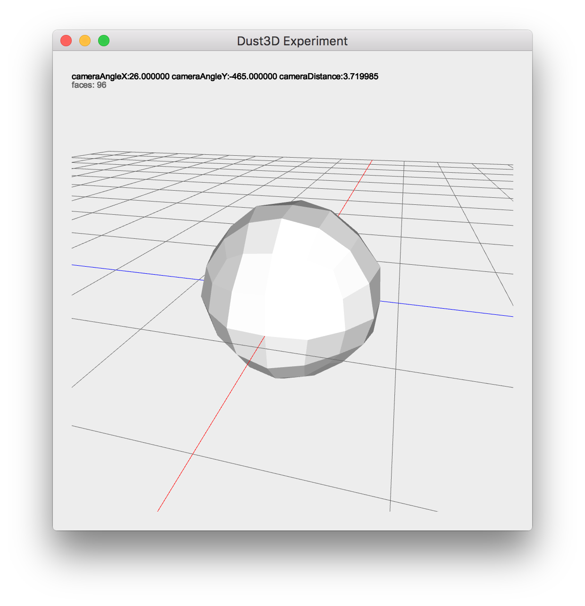
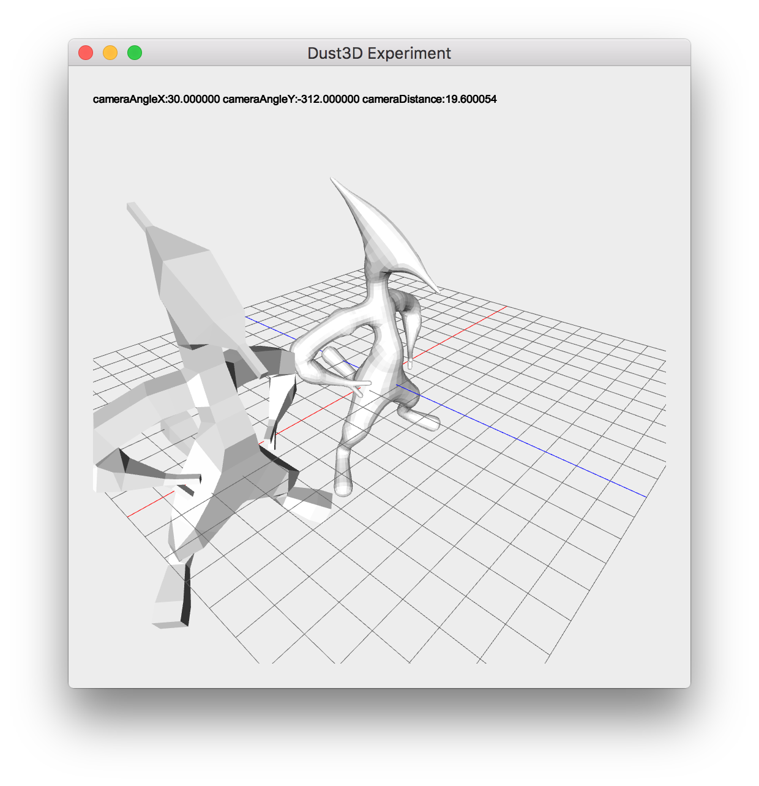
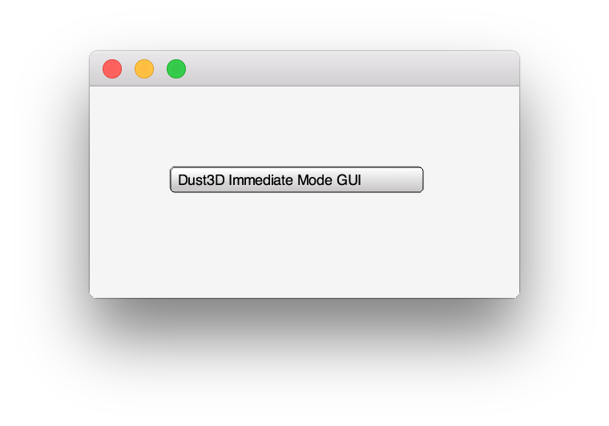
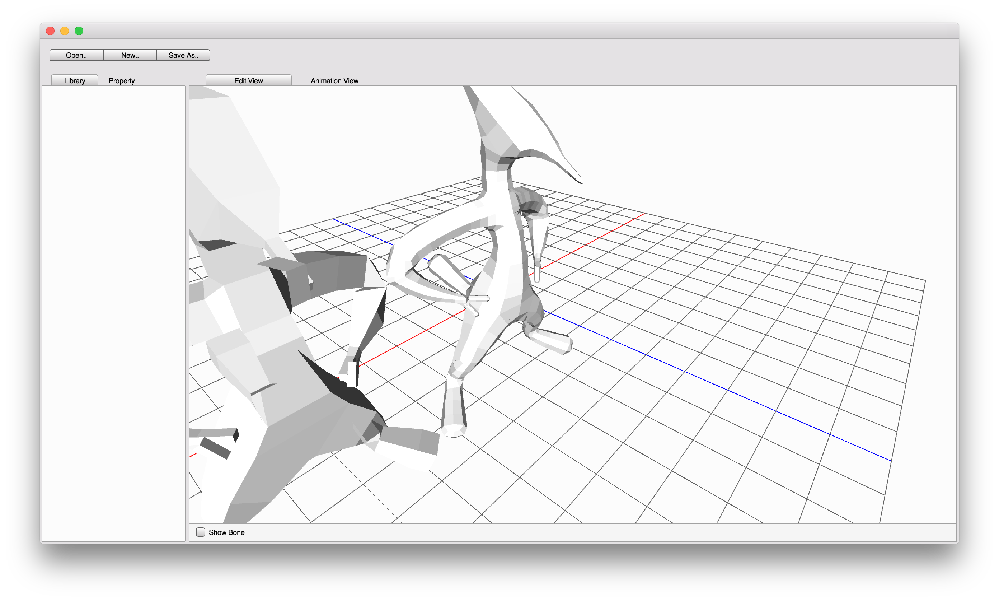

Dust3D
=========
Dust3D is aim to be a quick modeling tool for game development. Currently the development is in the very early stage.  
Please join the discussion [reddit/r/gamedev]( https://www.reddit.com/r/gamedev/comments/5iuf3h/i_am_writting_a_3d_monster_model_generate_tool/)

Idea
===========
I was inspired by Jimmy Gunawan's blogs of monster generation, here is the first one [INSPIRATION / Pixar Monster Factory Part One](http://blendersushi.blogspot.com.au/2013/06/inspiration-pixar-monster-factory-part.html), and by search the Skin Modifier of Blender, I found the theory of Skin Modifier:    
[B-Mesh: A Fast Modeling System for Base Meshes
of 3D Articulated Shapes](http://citeseerx.ist.psu.edu/viewdoc/download?doi=10.1.1.357.7134&rep=rep1&type=pdf)(Authors: Zhongping Ji, Ligang Liu, Yigang Wang). I started to think of monster model generation for game development from years ago, thanks for this paper, Dust3D is achievable now.  
From my initial thought, Dust3D should be a tool like [Makehuman](http://www.makehuman.org), with more versatile features, not only can make human, but also be able to **generate monsters automatically**.  

TODO & Progress
==============
- [x] Drawing Primitives (Dec 15, 2016 ~ Dec 17, 2016)   
*Sphere*  
I don't want the whole project have any unnecessary dependent, like glu library.
Let's start with [drawing a sphere without gluSphere]( http://stackoverflow.com/questions/7687148/drawing-sphere-in-opengl-without-using-glusphere), because I want implement the same spheres which presented in the [B-Mesh paper](http://citeseerx.ist.psu.edu/viewdoc/download?doi=10.1.1.357.7134&rep=rep1&type=pdf).   
*Cylinder*  
Two caps and many strips composites a cylinder.  
*Infinite Grid*  
Almost all 3D editor have a infinite grid ground, I just made a finite one, in the future, I should expand the grid outside of the screen to make it infinite.  
Now, for just beginning, I think it's a not bad start.

- [x] Implement B-Mesh algorithm (Dec 18, 2016 ~ Jan 04, 2017)   
There is a implementation of [B-Mesh algorithm in C++](https://github.com/evanw/cs224final) language, but I want the pure C version, so I start to implement my own version. I read both paper and this implementation, it gave me very helpful understanding of this algorithm.    
*Drawing Skeletal Shape Balls*  
Draw shape ball is easy, no need to rotate, I just need scale it along the ball's radius.
Draw the cylinder which connects two shape balls is more difficult, I need do some math to rotate it. [Here](http://www.thjsmith.com/40/cylinder-between-two-points-opengl-c) described it.  
*Camera Control*  
Camera rotate/zoom implemented, [here](http://www.songho.ca/opengl/gl_transform.html) is a good article which explained the theory of OpenGL Transformation. Most important is that the demo app is very beautiful.  
Added x,z axis, looks better than last screenshot.   
I have to use the GLU library, the previous implementation of drawSphere and drawCylinder looks not good, and take too much time to debug.  
  
*B-Mesh data struct*  
I created the test nodes's geometry information from Blender. Here is the render result of `data/bmesh_test_1.h`  
  
*Generate Inbetween Nodes*  
    
*Generate Mesh*  
  
When I am implementing the B-Mesh algorithm, I am also think in the future, how to create a library of bunch of initial base models. There is a paper [the Skeleton of a Closed 3D Shape](http://www1.idc.ac.il/icgf/GraphicsSeminar2006/DCGskeleton06.pdf) described how to generate skeleton from mesh, this is the reverse progress of what I am doing, I think it can resolve the problem of insufficient initial base models, I can generate from tons of existed models.  
*Convex Hull*  
After finish the rotation at the two connected bones, I need implement 3D Convex Hull algorithm at the joint ball, there are so many methods to get the convex hull, I found the [Gift wrapping](http://dccg.upc.edu/people/vera/wp-content/uploads/2014/11/GA2014-ConvexHulls3D-Roger-Hernando.pdf) is the most strait-forward one, though is not the most efficient one.  
There is a good implementation of [Gift Wrapping algorithm written in lua](https://github.com/danielhst/3d-Hull-gift-wrap/blob/master/giftWrap.lua) language. When I was implementing, I first translated this version to C language, but maybe there are some bugs on my own translation, there are lots of repeated faces, so changed a little, the code now is not just the translation of the original lua version.  
  
*Stitching*  
I follow the B-Mesh paper, made another test module inside Blender, and created a correspond `data/bmesh_test_2.h` manually.  
      
*Catmull-Clark Subdivision*  
      
There is a implementation of Catmull-Clark Subdivision algorithm on [rosettacode](https://rosettacode.org/wiki/Catmull%E2%80%93Clark_subdivision_surface/C), the code is very simple and beautiful, just lack of some memory alloc fail check. I translated the algorithm to use my own array implementation.  
Now, the render result looks not bad after 2 times of subdivisions. I would like to mark this todo as done, though there are more polish steps on the original paper, I just leave it as to be done in the future.
- [x] Render B-Mesh result  
This todo already done in the B-Mesh algorithm implementation.  
- [ ] Design UI for monster parts configuration  
  **Jan 17, 2017 ~ Jan 18, 2017:**    
  *Skeleton Editor*  
  There is a good tutorial introduced how to implement object selection by mouse in OpenGL, written by [Bartek](http://www.bfilipek.com/2012/06/select-mouse-opengl.html).  
  But there is a big pain in the progress of implement the object selection logic, because of resizeGL, the width and height which passed in as parameters of this function is not equal to the size of the window.  
  **Feb 3, 2017:**  
  Recently, I submitted a patch(https://developer.blender.org/D2489) to blender to fix a crash bug, because is just a quick fix and I am not familiar with the blender's code, so the patch is not fixing the real problem, though the bug is there, and Gaia Clary fixed it. What I am trying to say is when I was compiling the blender code, there was a real pain to fix some third part dependency and different C++ version problem.  
  So I reconsidered the GUI of Dust3d, I want remove all the C++ code inevitably including the Qt library. Maybe I need try just use OpenGL to draw the interface in the next step.  
  **Feb 8, 2017:**  
  There are lots of changes to the UI part of Dust3D, though not commit yet because of many things have not been finalize.  
  I removed the Qt, the counterpart of the build system is CMake, and instead of using Qt based OpenGL windows, I am using my own implemented OpenGL support library. I considered using the most popular [Dear ImGui](https://github.com/ocornut/imgui) library, but I really want remove the C++ from the codebase. It's a good start of the skeleton editor UI!  
    
  **Feb 11, 2017:**  
  Qt removed, so C++ removed, but Objective-C imported for just support the OpenGL environment on OSX.  
    

- [ ] Render rigid animation  
- [ ] png exporter for isometric 2.5D game  
- [ ] Export Wavefront .obj
- [ ] Materials merge of different parts      
- [ ] Version 0.01 release  
- [ ] Implement [the Skeleton of a Closed 3D Shape](http://www1.idc.ac.il/icgf/GraphicsSeminar2006/DCGskeleton06.pdf)  
