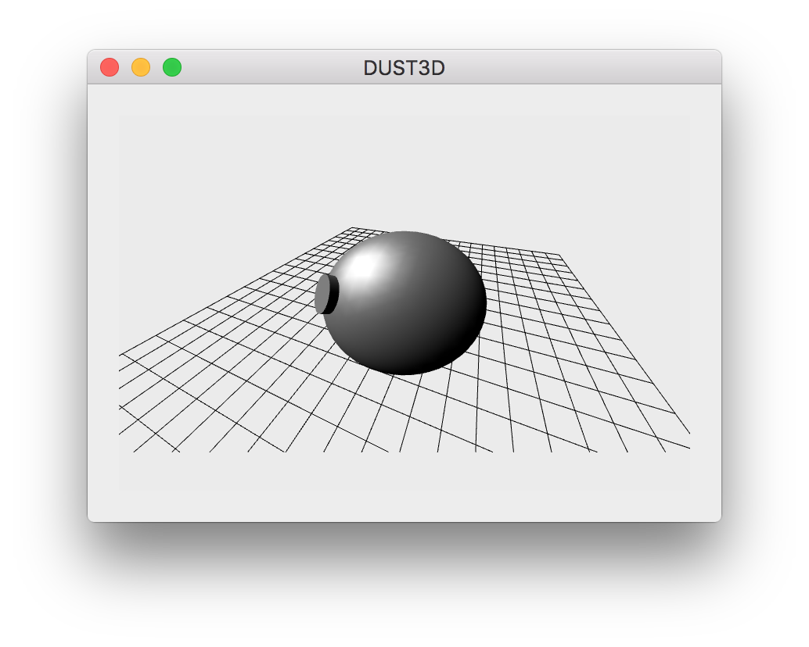
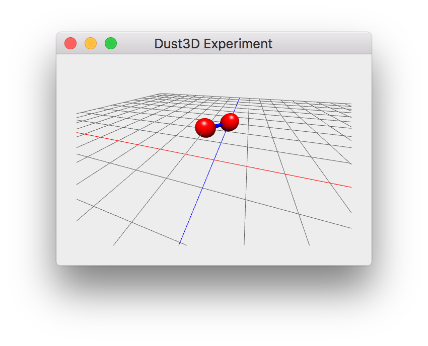
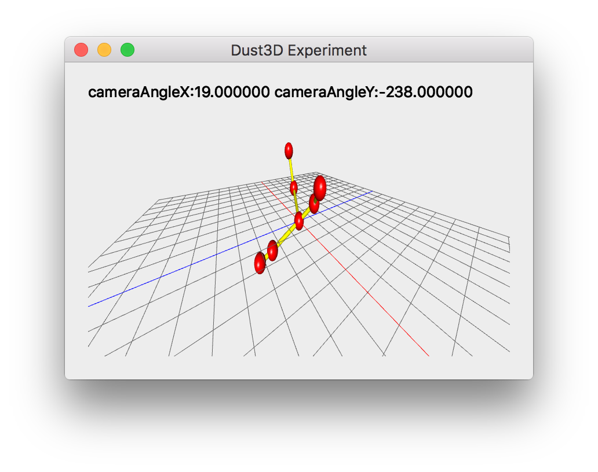
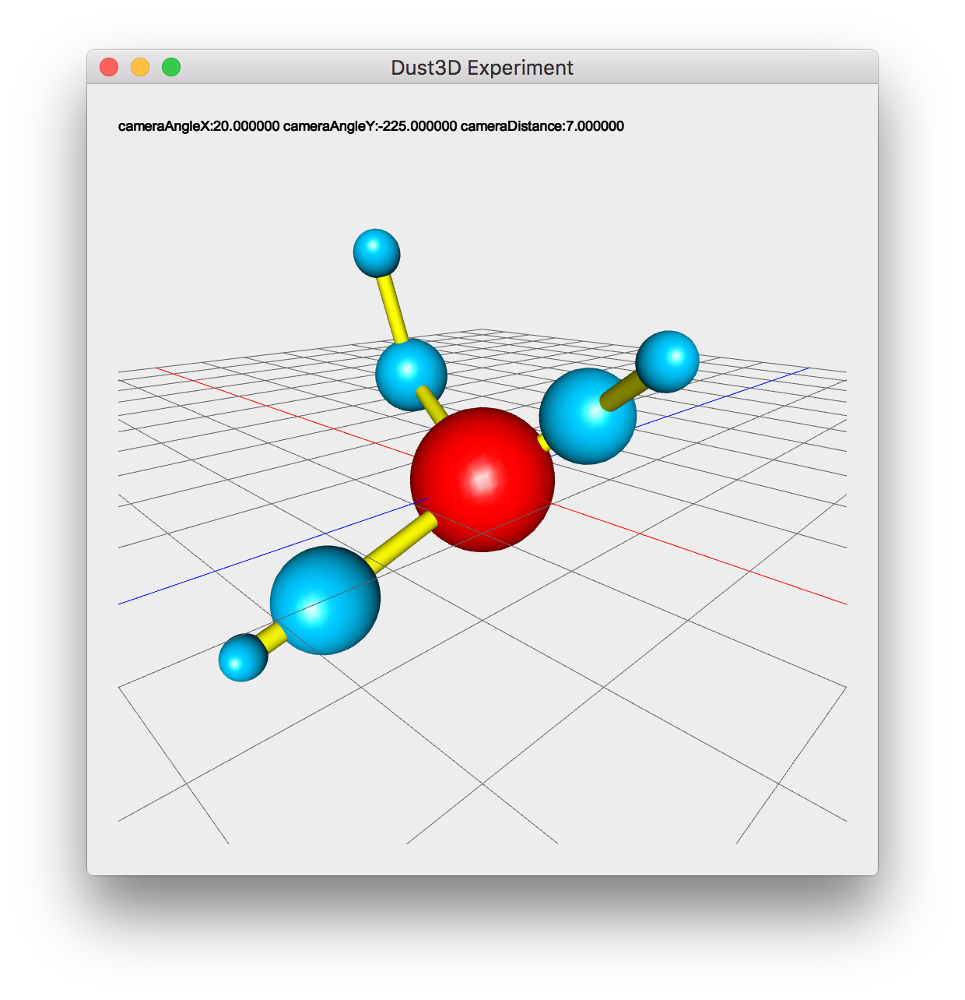
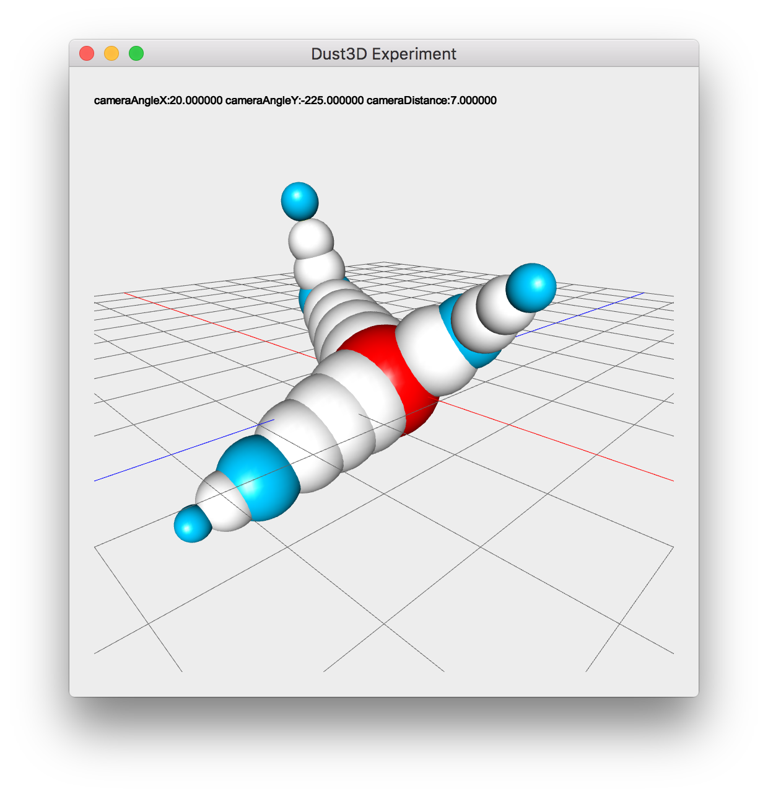
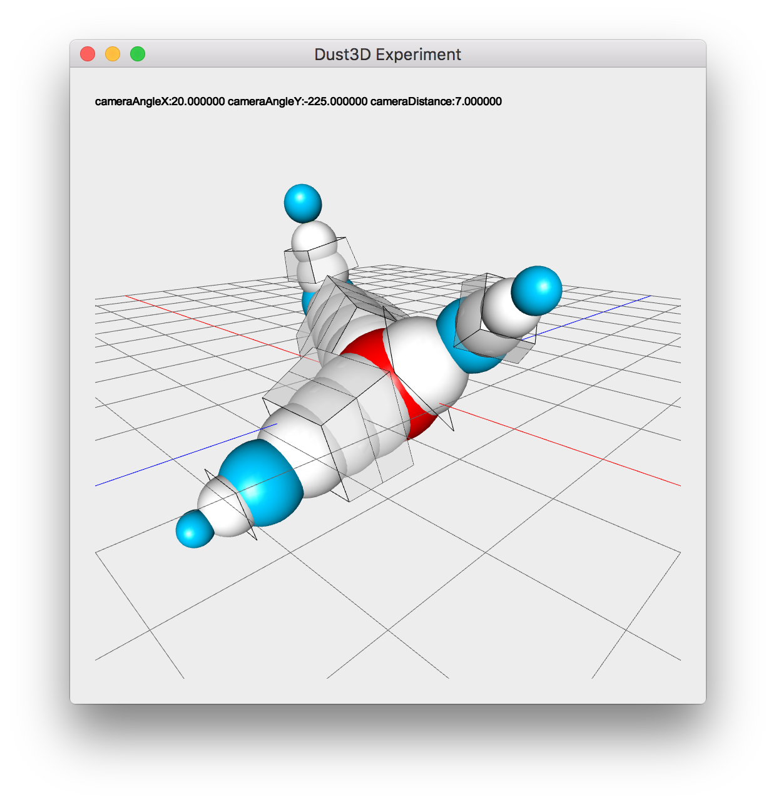
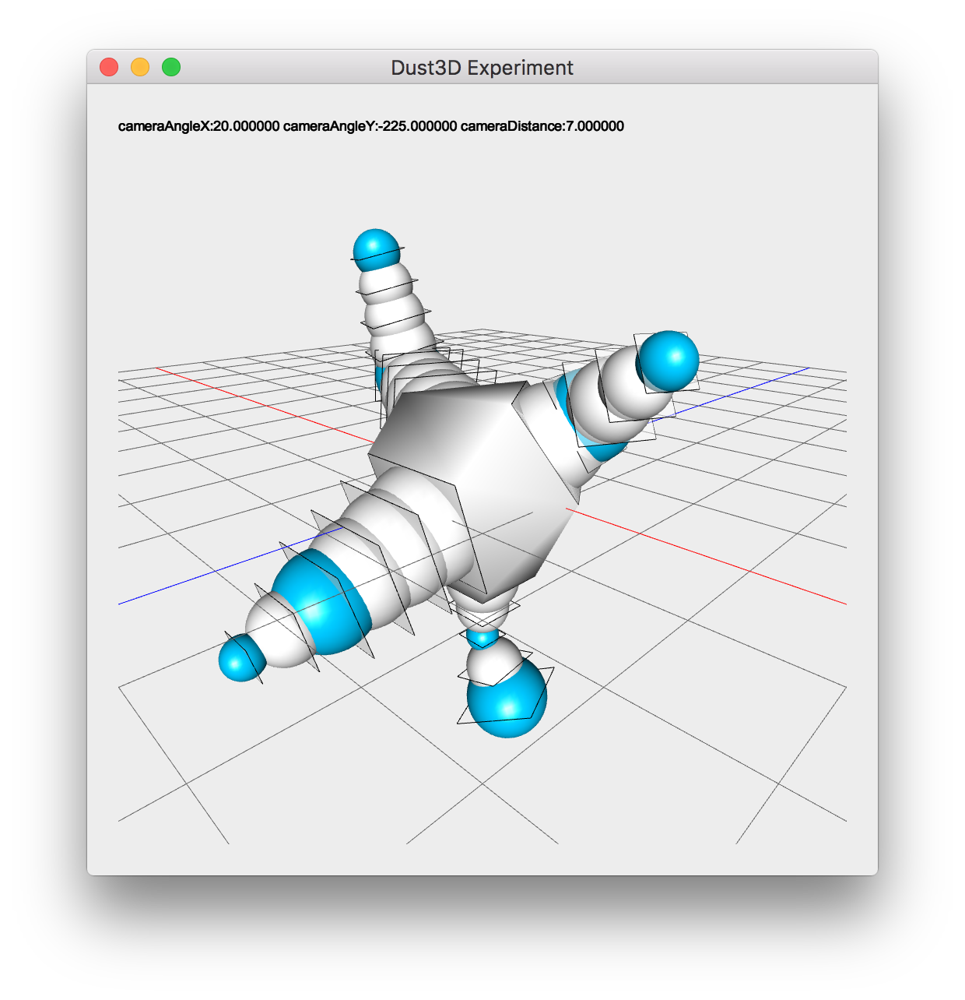
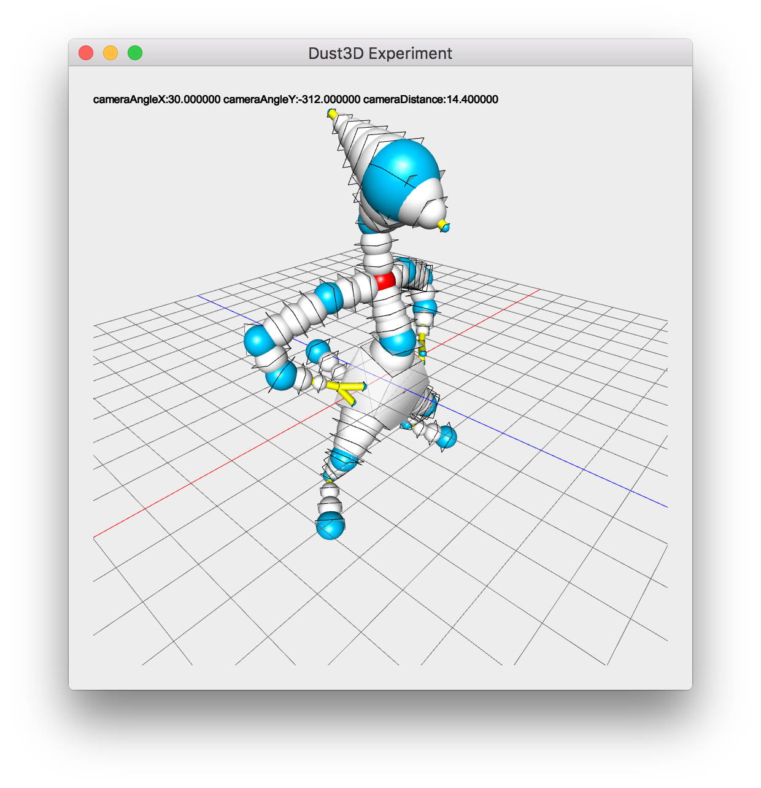
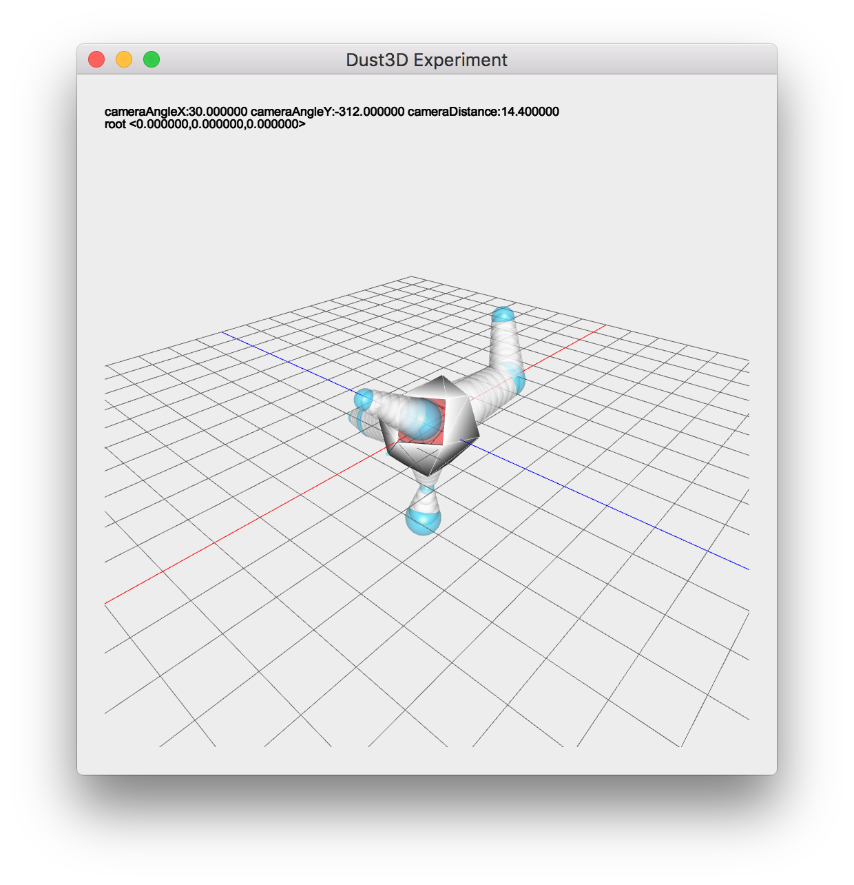
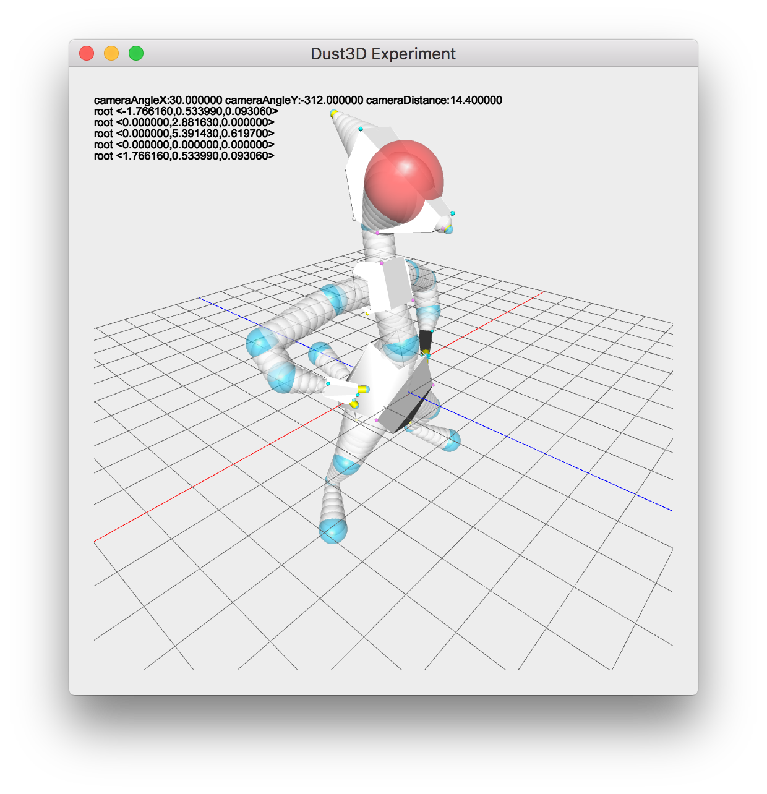

Dust3D
=========
Dust3D is aim to be a quick modeling tool for game development. Currently the development is in the very early stage.  
Please join the discussion [reddit/r/gamedev]( https://www.reddit.com/r/gamedev/comments/5iuf3h/i_am_writting_a_3d_monster_model_generate_tool/)

Idea
===========
I was inspired by Jimmy Gunawan's blogs of monster generation, here is the first one [INSPIRATION / Pixar Monster Factory Part One](http://blendersushi.blogspot.com.au/2013/06/inspiration-pixar-monster-factory-part.html), and by search the Skin Modifier of Blender, I found the theory of Skin Modifier:    
[B-Mesh: A Fast Modeling System for Base Meshes
of 3D Articulated Shapes](http://citeseerx.ist.psu.edu/viewdoc/download?doi=10.1.1.357.7134&rep=rep1&type=pdf)(Authors: Zhongping Ji, Ligang Liu, Yigang Wang). I started to think of monster model generation for game development from years ago, thanks for this paper, Dust3D is achievable now.  
From my initial thought, Dust3D should be a tool like [Makehuman](http://www.makehuman.org), with more versatile features, not only can make human, but also be able to **generate monsters automatically**.  

Build
============
*Generate Xcode Project*  
```
$ cd build
$ qmake -spec macx-xcode
```
*Generate Makefile*
```
$ cd build
$ qmake
$ make
```

TODO & Progress
==============
- [x] Drawing Primitives (Dec 15, 2016 ~ Dec 17, 2016)   
*Sphere*  
I don't want the whole project have any unnecessary dependent, like glu library.
Let's start with [drawing a sphere without gluSphere]( http://stackoverflow.com/questions/7687148/drawing-sphere-in-opengl-without-using-glusphere), because I want implement the same spheres which presented in the [B-Mesh paper](http://citeseerx.ist.psu.edu/viewdoc/download?doi=10.1.1.357.7134&rep=rep1&type=pdf).   
*Cylinder*  
Two caps and many strips composites a cylinder.  
*Infinite Grid*  
Almost all 3D editor have a infinite grid ground, I just made a finite one, in the future, I should expand the grid outside of the screen to make it infinite.  
Now, for just beginning, I think it's a not bad start.

- [ ] Implement B-Mesh algorithm (Dec 18, 2016 ~ Dec 26, 2016)   
*Drawing Skeletal Shape Balls*  
Draw shape ball is easy, no need to rotate, I just need scale it along the ball's radius.
Draw the cylinder which connects two shape balls is more difficult, I need do some math to rotate it. [Here](http://www.thjsmith.com/40/cylinder-between-two-points-opengl-c) described it.  
*Camera Control*  
Camera rotate/zoom implemented, [here](http://www.songho.ca/opengl/gl_transform.html) is a good article which explained the theory of OpenGL Transformation. Most important is that the demo app is very beautiful.  
Added x,z axis, looks better than last screenshot.   
I have to use the GLU library, the previous implementation of drawSphere and drawCylinder looks not good, and take too much time to debug.  
  
*B-Mesh data struct*  
I created the test nodes's geometry information from Blender. Here is the render result of `data/bmesh_test_1.h`  
  
*Generate Inbetween Nodes*  
    
*Generate Mesh*  
  
When I am implementing the B-Mesh algorithm, I am also think in the future, how to create a library of bunch of initial base models. There is a paper [the Skeleton of a Closed 3D Shape](http://www1.idc.ac.il/icgf/GraphicsSeminar2006/DCGskeleton06.pdf) described how to generate skeleton from mesh, this is the reverse progress of what I am doing, I think it can resolve the problem of insufficient initial base models, I can generate from tons of existed models.  
*Convex Hull*  
After finish the rotation at the two connected bones, I need implement 3D Convex Hull algorithm at the joint ball, there are so many methods to get the convex hull, I found the [Gift wrapping](http://dccg.upc.edu/people/vera/wp-content/uploads/2014/11/GA2014-ConvexHulls3D-Roger-Hernando.pdf) is the most strait-forward one, though is not the most efficient one.  
  
*Stitching*  
I follow the B-Mesh paper, made another test module inside Blender, and created a correspond `data/bmesh_test_2.h` manually.  
      
- [ ] Export Wavefront .obj  
- [ ] Render B-Mesh result  
- [ ] Design UI for monster parts configuration  
- [ ] Test B-Mesh realtime generation with UI  
- [ ] Render rigid animation  
- [ ] png exporter for isometric 2.5D game  
- [ ] Version 0.01 release  
- [ ] Materials merge of different parts     
- [ ] Implement [the Skeleton of a Closed 3D Shape](http://www1.idc.ac.il/icgf/GraphicsSeminar2006/DCGskeleton06.pdf)  
